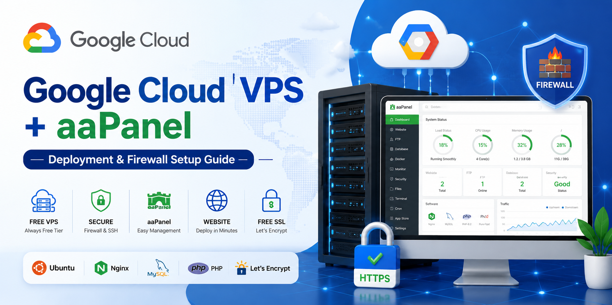

<p align="center">
  
</p>

<p align="center">
  <b>☁️ Google Cloud VPS + aaPanel Setup Guide</b>
</p>

<h1 align="center">Google Cloud aaPanel Deployment & Firewall Setup</h1>

<p align="center">
  Free VPS • Secure • Production Ready ⚡<br>
  Developed by <b>Amit Das</b>
</p>

---

# How to Create a Free VPS on Google Cloud and Host Websites with aaPanel (2026 Guide)

Google Cloud offers an Always Free tier that allows you to run a small virtual private server (VPS) without monthly hosting costs when used within the free limits. In this guide, you'll learn how to create a free VPS, install aaPanel, configure your server, and host websites with free SSL certificates.

This setup is ideal for:

* Personal websites
* Blogs
* Portfolio websites
* Small business websites
* APIs
* Development environments
* Learning Linux and server administration

---

# What You'll Build

By the end of this guide, you'll have:

* A Google Cloud VPS running Ubuntu 24.04 LTS
* aaPanel installed and secured
* Nginx, MySQL, and PHP configured
* A custom domain connected
* Free SSL certificates enabled
* A production-ready web hosting environment

---

# Prerequisites

Before starting, make sure you have:

* A Google account
* A Google Cloud account
* Billing enabled
* A domain name (recommended)
* Basic knowledge of SSH

---

# Understanding Google Cloud Always Free

Google Cloud's Always Free program includes resources that can be used without monthly charges if you stay within the limits.

Recommended configuration:

| Resource         | Value                    |
| ---------------- | ------------------------ |
| Machine Type     | e2-micro                 |
| Operating System | Ubuntu 22.04 LTS         |
| Disk Type        | Standard Persistent Disk |
| Disk Size        | 30 GB                    |
| Network Tier     | Premium                  |

To avoid unexpected charges:

* Use only an e2-micro instance
* Keep storage at or below 30 GB
* Use Standard Persistent Disk
* Avoid unnecessary snapshots
* Monitor bandwidth usage

---

# Step 1: Create a Google Cloud VPS

Open Google Cloud Console.

Navigate to:

```text
Compute Engine → VM Instances
```

Click:

```text
Create Instance
```

---

## VM Configuration

Configure the server using the following settings:

| Setting          | Value                     |
| ---------------- | ------------------------- |
| Name             | your-server-name          |
| Region           | Free Tier Eligible Region |
| Machine Type     | e2-micro                  |
| Operating System | Ubuntu 22.04 LTS          |
| Disk Type        | Standard Persistent Disk  |
| Disk Size        | 30 GB                     |

Enable:

```text
Allow HTTP Traffic
Allow HTTPS Traffic
```

---

# Important: Disable Optional Features

These settings help reduce the risk of unexpected charges.

## Data Protection

Disable:

```text
Backups
```

Reason:

Backup snapshots consume storage and may incur charges.

---

## Observability

Disable:

```text
Install Ops Agent for Monitoring and Logging
```

Reason:

Large amounts of monitoring and logging data can generate additional costs.

---

## Security

Under:

```text
Service Account
```

Select:

```text
No Service Account
```

Reason:

A basic web server does not require access to Google Cloud APIs.

---

## Networking

Under:

```text
Network Service Tier
```

Keep:

```text
Premium
```

Reason:

The free outbound bandwidth allowance applies to the Premium network tier.

---

# Create the VM Using gcloud CLI (Optional)

You can also create the server using the command line.

```bash
gcloud compute instances create my-server \
    --zone=us-central1-c \
    --machine-type=e2-micro \
    --network-interface=network-tier=PREMIUM,stack-type=IPV4_ONLY,subnet=default \
    --maintenance-policy=MIGRATE \
    --provisioning-model=STANDARD \
    --no-service-account \
    --no-scopes \
    --tags=https-server,http-server \
    --create-disk=auto-delete=yes,boot=yes,image-family=ubuntu-2404-lts-amd64,image-project=ubuntu-os-cloud,size=30,type=pd-standard \
    --shielded-vtpm \
    --shielded-integrity-monitoring
```

---

# Step 2: Connect to Your VPS

Once the VM is running:

```text
Compute Engine → VM Instances → SSH
```

Or connect using:

```bash
ssh username@SERVER_IP
```

Update the server:

```bash
sudo apt update
sudo apt upgrade -y
```

---

# Step 3: Install aaPanel

Switch to root:

```bash
sudo -i
```

## 🔐 Step 2: Install aaPanel

```bash
URL=https://www.aapanel.com/script/install_panel_en.sh && if [ -f /usr/bin/curl ];then curl -ksSO $URL ;else wget --no-check-certificate -O install_panel_en.sh $URL;fi;bash install_panel_en.sh ipssl
```

Installation usually takes several minutes.

---

# Step 4: Save Login Information

After installation completes, aaPanel displays:

```text
Panel URL
Username
Password
```

Example:

```text
http://SERVER_IP:8888/random-security-path
```

Save these credentials securely.

---

# Step 5: Configure Google Cloud Firewall

Open:

```text
VPC Network → Firewall
```

### ➕ Add Ingress Rules

| Port        | Purpose          |
| ------------| ---------------- |
| 21          | FTP              |
| 22          | SSH              |
| 25          | SMTP             |
| 80          | HTTP             |
| 443         | HTTPS            |
| 465         | SMTPS (SSL Mail) |
| 587         | SMTP Submission  |
| 888         | phpMyAdmin       |
| 993         | IMAPS            |
| 995         | POP3S            |
| 2001        | aaPanel Custom   |
| 2004        | aaPanel Panel    |
| 3306        | MySQL/MariaDB    |
| 5432        | PostgreSQL       |
| 6379        | Redis            |
| 8000        | Backend/API      |
| 23309       | aaPanel Alt Port |
| 27017       | MongoDB          |
| 30000-40000 | FTP Passive      |

### Ports to allow:

```
80,2001,21,25,465,587,888,993,995,2004,3306,5432,6379,8000,23309,27017,30000-40000
```

---

# Step 6: Access aaPanel

Open:

```text
http://SERVER_IP:8888
```

Or the security URL generated during installation.

Log in using your aaPanel credentials.

---

# Step 7: Install Recommended Software

After the first login, aaPanel asks which software stack to install.

Recommended:

```text
Nginx
MySQL
PHP
Pure-FTPd
phpMyAdmin
```

Click:

```text
One-Click Install
```

Wait for installation to finish.

---

# Step 8: Secure aaPanel

Immediately perform these security tasks:

* Change admin username
* Change admin password
* Enable panel SSL
* Configure email notifications
* Enable automatic updates
* Restrict panel access if possible

---

# Step 9: Add Your Website

Navigate to:

```text
Website → Add Site
```

Enter:

* Domain Name
* PHP Version
* Database Option

Click:

```text
Submit
```

aaPanel automatically creates:

* Website directory
* Virtual host configuration
* Optional database

---

# Step 10: Point Your Domain to the Server

Find your VPS public IP address.

Create DNS records.

Root domain:

```text
Type: A
Host: @
Value: SERVER_IP
```

WWW subdomain:

```text
Type: A
Host: www
Value: SERVER_IP
```

Wait for DNS propagation.

---

# Step 11: Upload Website Files

Website files are stored in:

```text
/www/wwwroot/yourdomain.com
```

Upload using:

* aaPanel File Manager
* FTP
* SFTP
* Git Deployment

Example test page:

```html
<!DOCTYPE html>
<html>
<head>
    <title>Google Cloud VPS</title>
</head>
<body>
    <h1>Website Successfully Deployed</h1>
</body>
</html>
```

---

# Step 12: Enable Free SSL

Navigate to:

```text
Website → SSL
```

Select:

```text
Let's Encrypt
```

Issue the certificate.

Enable:

```text
Force HTTPS
```

Your website will now use HTTPS automatically.

---

# Step 13: Create a Database

Navigate to:

```text
Database → Add Database
```

Create:

* Database Name
* Username
* Password

Save the credentials.

Use phpMyAdmin for database management.

---

# Step 14: Deploy WordPress (Optional)

Open:

```text
App Store
```

Install:

```text
WordPress
```

Or manually upload WordPress files to:

```text
/www/wwwroot/yourdomain.com
```

Complete the installation wizard.

---

# Server Maintenance

Update Ubuntu:

```bash
sudo apt update
sudo apt upgrade -y
```

Restart server:

```bash
sudo reboot
```

Check disk usage:

```bash
df -h
```

Check memory usage:

```bash
free -h
```

---

# Useful aaPanel Features

* Website Management
* File Manager
* Database Manager
* FTP Accounts
* SSL Certificates
* Cron Jobs
* Security Tools
* Backup Management
* Docker Manager
* Terminal Access

---

# Troubleshooting

## Cannot Access aaPanel

Verify:

* Port 8888 is open
* Firewall rule exists
* VPS is running

---

## SSL Certificate Failed

Check:

* Domain points to server IP
* Port 80 is open
* DNS propagation has completed

---

## Website Not Loading

Verify:

* Domain DNS records
* Nginx service status
* Website configuration

---

## High Resource Usage

The e2-micro instance has limited resources.

Recommendations:

* Use Nginx instead of Apache
* Disable unused services
* Avoid running multiple heavy websites

---

# Conclusion

Google Cloud's Always Free tier combined with aaPanel provides a powerful and cost-effective hosting environment for personal projects, websites, blogs, and applications. By following the recommended configuration and avoiding unnecessary services, you can run a reliable VPS with a user-friendly hosting control panel while staying within the free usage limits.

---

## 📬 Support

<p align="center">
  <a href="https://t.me/BlueOrbitDevs">
    
  </a>
</p>

---

## 📜 License

MIT License © 2026 Amit Das

---

<p align="center">
  <b>Deploy Smart • Secure Fast 🚀</b>
</p>